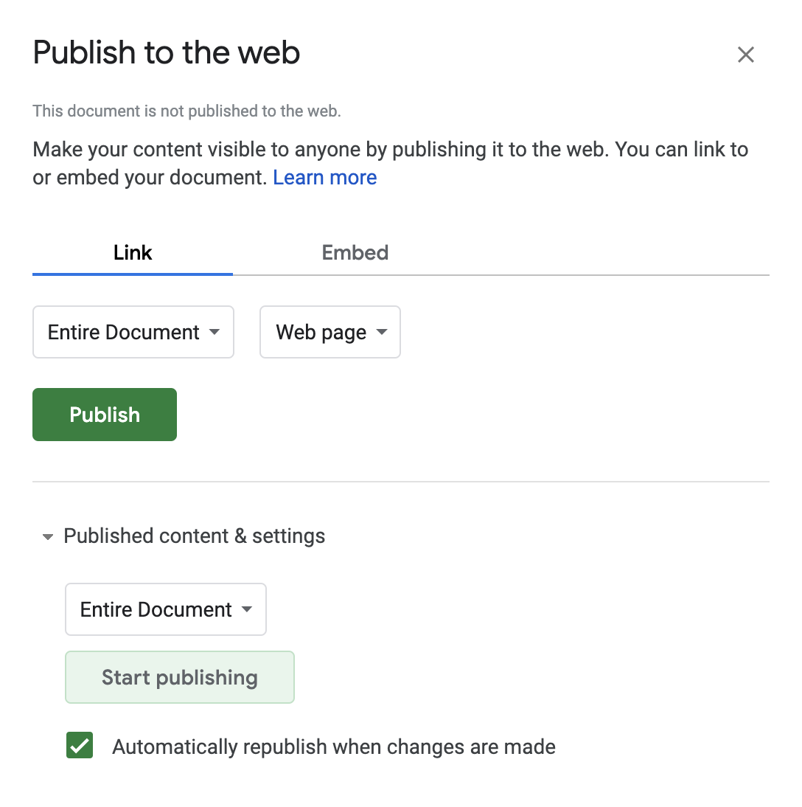

Gus connects Google Spreadsheets with Maps. The goal is to allow users to quickly and easily create a new, accessible, and updatable point-based map via simple spreadsheets.

[Example map](http://mapsam.com/gus/map/?1phY589_LeK9_0TQtdL01t7Y8Fcj_PS1l98TnJCdknLM)

# INSTRUCTIONS

#### Create a spreadsheet

**First thing's first** - you'll have to create a spreadsheet under a google account. [Click here](https://docs.google.com/spreadsheet/) to get one going (you'll have to be signed into your Google account first). This is the hub of your map data, where it all happens.

#### Copy example data

Next, you'll want to copy **[this spreadsheet's data](https://docs.google.com/spreadsheets/d/1phY589_LeK9_0TQtdL01t7Y8Fcj_PS1l98TnJCdknLM/edit#gid=0)** to ensure you properly format your spreadsheet for GUS to work. The spreadsheet only requires two columns, **lat** and **lng** to process properly. From there, you can add any number of columns and name them whatever you'd like.

#### Publish your spreadsheet

In order for GUS to pull your data, you'll want to publish the spreadsheet to the web. This is configurable via the File menu: **File** > **Publish to the web**. *NOTE: this is not making your spreadsheet publicly editable. If you want others to be able to add points, you should edit your share settings via the "share" button on the right side of the screen when you are editing.*

Press the "publish" button.

#### Obtain spreadsheet unique key

Grab the unique key in you spreadsheets URL, which you can copy from your browser.

<pre><code>
https://docs.google.com/spreadsheets/d/<b>19bL6SzPokjp3TQ954gvcnB-8DypM6emymUHJYDqZcUg</b>/edit
https://docs.google.com/spreadsheets/d/<b>YOUR_UNIQUE_ID</b>/edit
</code></pre>

*NOTE: **this is not the URL generated by the "publish to web" section!** originally you were supposed to use the unique identifier from the URL after you publish, now you can use the primary identifier from your spreadsheet.*

#### Create GUS URL via unique key

Lastly, pass this spreadsheet key as a parameter into the *GUS* url field. You can do this in two ways:

1. Head to [mapsam.com/gus/map/](http://mapsam.com/gus/map/) with your unique key and enter it in the field.
1. Build your URL manually <code>http://mapsam.com/gus/map?<b>YOUR_UNIQUE_ID</b></code>

If there are no problems with your data, you should see a map populate automatically with your point data. If not, you will see errors in the site or in the developer console of your browser.

---

From here you can add points to your spreadsheet and it should update automatically on the map. If it doesn't, it's likely due to your spreadsheet not updating automatically on changes - make sure to check the settings in *Publish to the web*. Share your spreadsheet with whomever you want to be able to edit.

# NOTES

#### Getting latitude and longitude values

When viewing your map, if you **right click** you will see a notification of the latitude and longitude coordinates of that point on the map. Copy these for use in your spreadsheet.

#### Naming your map

The name of your spreadsheet when viewing on the GUS site is populated from the sheet name. **This is not the file name** but rather the name of the sheet in the bottom left corner. Spreadsheets are made of sheets, and each sheet can be renamed. You can rename the sheet from *Sheet1* (default) to anything you want and it should populate accordintely on the GUS site via your URL.

#### Column headers

You can edit column headers to be whatever you'd like. Right now the *only* required column names are `lat` & `lng`. One important thing to note, Tabletop only returns "safe name" column headers, meaning it removes spaces, capitol letters, and special characters. This results in the column headers in your info panel showing up accordingly, and not how you type them in your spreadsheet. For example, `My First Name` results in `myfirstname`. Just be careful when naming them!

# BACKGROUND

> On a *mostly normal* day in September 2014, a friend's brother went missing in Montana. Geographically disconnected and unable to join in the search campaign, I could only watch and hope new updates would open on the Facebook group. Over time many updates dealt with where people had searched or where search parties would be exploring over the day, but soon became disorganized due to Facebook's lack of temporal order and prioritization on likes.

> It seemed hard to track **where** the search was happening, so quickly I put together a spreadsheet for people to add latitude and longitude points with quick descriptions and their name, which populated at an accessible URL.

> Fortunately, our friend **Gus** was found shortly thereafter. This repo, although not directly influential on the outcome, is built on inspiration and community. It is here for others in the same situation, or for those who just want a map of points. Either way, what matters most has been found, and now we use Gus' story to inspire ourselves.
